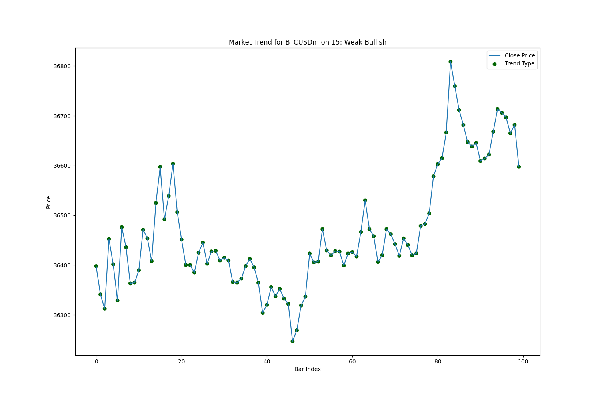

# Trend Analyzer

## Overview

Trend Analyzer is a Python script designed to analyze market trends in financial time series data, specifically using the MetaTrader 5 platform. It calculates linear regression, residuals, and standard deviation to provide insights into market trends and their strength.

## Features

- Fetches historical market data from MetaTrader 5.
- Performs linear regression analysis on the closing prices.
- Calculates residuals and standard deviation to assess the fit of the linear regression model.
- Visualizes trends, linear regression lines, and residuals for better understanding.

## Getting Started

### Prerequisites

- Python 3.x
- MetaTrader 5 platform

### Installation

1. Clone the repository:

   ```bash
   git clone https://github.com/zuhairabid/Market-Trend-Analyzer.git
   ```
2. Install the required dependencies:
    
    ```bash
    pip install -r requirements.txt
    ```

## Usage
1. Open MetaTrader 5 and ensure the MetaTrader 5 API is enabled.

2. Run the script:
    ```bash
    python main.py
    ```
3. Instruction to use functions is given with the respective functions.


## Example

   



## License
This project is licensed under the MIT License

## Acknowledgments
Special thanks to the MetaTrader5 platform.
Inspiration from financial analysis and trend-following strategies.
